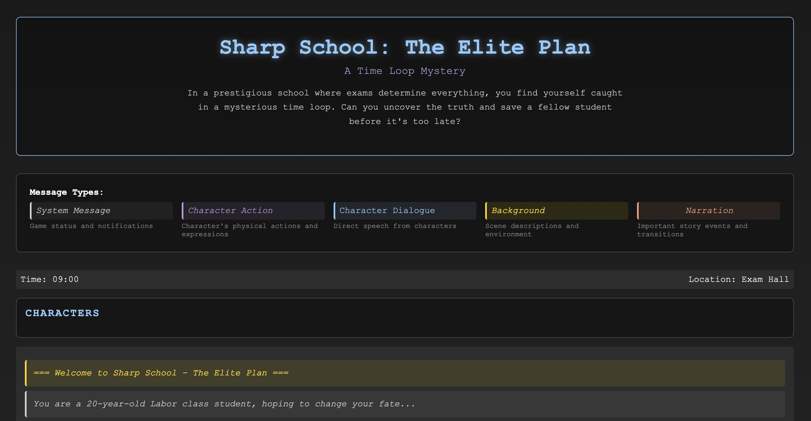

# Sharp School - Interactive Storytelling Game



An interactive text adventure game based on a time loop mechanism. Players must solve puzzles, engage in conversations, and save their fellow student within a limited time frame.

## Features

- Natural Language Interaction
- Dynamic Dialogue System
- Time Loop Mechanism
- Multiple Endings
- Character Trust System

## Tech Stack

### Backend
- FastAPI
- OpenAI GPT API
- Python 3.9+
- Uvicorn

### Frontend
- Vue 3
- TypeScript
- Vite
- Pinia

## Setup Instructions

### 1. Environment Setup

```bash
# Clone repository
git clone https://github.com/MPX0222/StorytellingAgent.git
cd StorytellingAgent

# Create virtual environment
conda create -n story_agent python=3.9
conda activate story_agent
```

### 2. Backend Configuration

```bash
# Navigate to backend directory
cd backend

# Install dependencies
pip install -r requirements.txt

# Create and configure .env file
cp .env.example .env
```

Edit `.env` file with your configuration:
```env
OPENAI_API_KEY=your_openai_api_key
OPENAI_API_BASE=your_openai_api_base
OPENAI_MODEL_NAME=gpt-3.5-turbo
OPENAI_TEMPERATURE=0.7
OPENAI_MAX_TOKENS=1000
```

### 3. Frontend Configuration

```bash
# Navigate to frontend directory
cd sharp-school

# Install dependencies
npm install

# Configure environment variables
cp .env.example .env.local
```

Edit `.env.local` file:
```env
VITE_API_BASE_URL=http://localhost:8000
```

### 4. Start Services

Backend:
```bash
# In backend directory
uvicorn app.main:app --reload --port 8000
```

Frontend:
```bash
# In sharp-school directory
npm run dev
```

Visit http://localhost:5173 to start playing.

## API Documentation

Access the complete API documentation at http://localhost:8000/docs after starting the backend service.

## Game Guide

1. Basic Controls
   - Use command line for natural language input
   - Click action buttons
   - Build trust through conversations

2. Key Tips
   - Watch the time
   - Observe character reactions
   - Use information from each loop

## Development Guide

### Adding New Characters

1. Create new character class in `backend/agents`
2. Inherit from `LLMAgent` base class
3. Implement required methods:
   - `process_dialogue`
   - `get_dialogue_options`

### Adding New Locations

1. Add new location in `game_state.py`
2. Update `_handle_movement` method
3. Add corresponding scene descriptions

## Contributing

1. Fork the repository
2. Create a feature branch
3. Submit changes
4. Create Pull Request

## License

MIT License